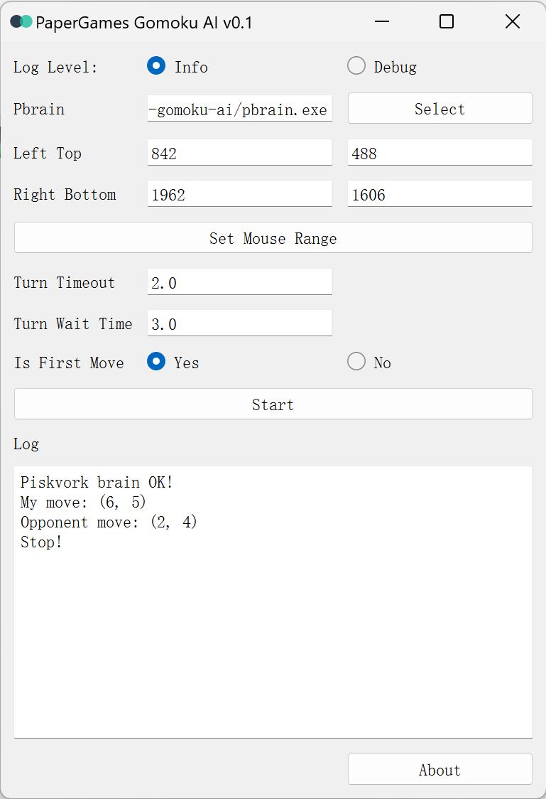

# PaperGames Gomoku AI

Gomoku AI for [papergames.io](https://papergames.io/).

**Warning: For study only, not for commercial use.**

## Usage

1. Download this zip file in release page.

2. Unzip the file.

3. Open main.exe.

4. Now you need to select a `pbrain` executable file, which is the Gomoku AI for [PiskVork](https://gomocup.org/download-gomocup-manager/). You can download one from [here](https://gomocup.org/download-gomoku-ai/).

5. Open this [page](https://papergames.io/en/gomoku) and start a game with the bot. Then click `Set Mouse Range` button in main.exe and follow the instruction.

6. Set `turn timeout` and `turn wait time`. `turn timeout` is the maximum time for AI to think for one turn, and `turn wait time` is the minimum time for one turn.

7. Now you can start a game. Choose `Yes` if you are the first one to play. Make sure nothing is covering the brower and don't use mouse or keyboard during the game.

## Thanks

+ [qbittorrent-api](https://github.com/rmartin16/qbittorrent-api)
+ [transmission-rpc](https://github.com/trim21/transmission-rpc)